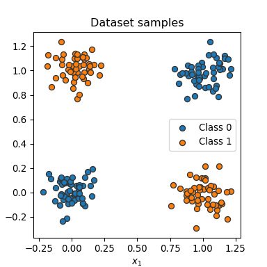
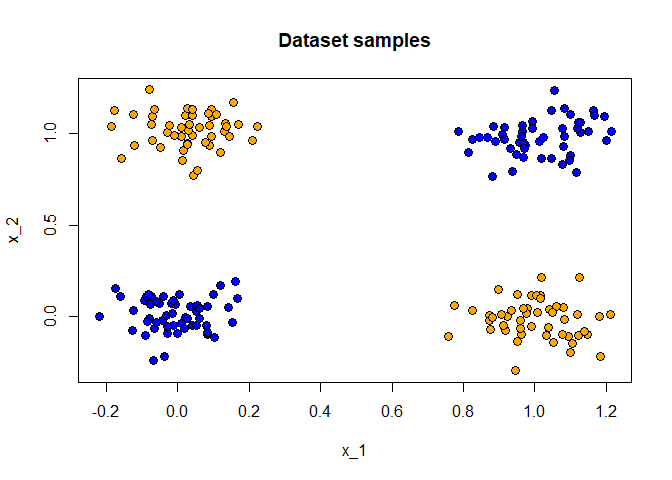
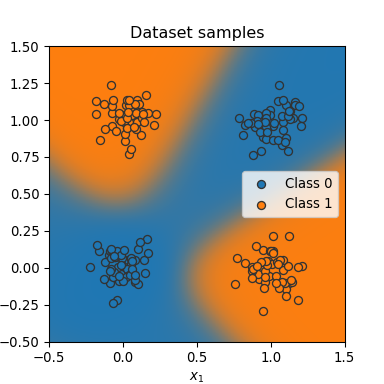

Okay, on to the good stuff. I’ll be quoting from [the
tutorial](https://uvadlc-notebooks.readthedocs.io/en/latest/tutorial_notebooks/tutorial2/Introduction_to_PyTorch.html)
pretty heavily in this notebook.

``` r
library(reticulate)
```

``` python
import time
import matplotlib.pyplot as plt
from matplotlib.colors import to_rgba
import torch
import torch.nn as nn
import torch.utils.data as data

## Progress bar
from tqdm.notebook import tqdm

print("Using torch", torch.__version__)
```

    ## Using torch 2.0.1

``` python
torch.cuda.is_available()
```

    ## True

# Pytorch Basics (cont.)

## Dynamic Computation Graph and Backpropagation

When we create a tensor in torch, its gradient is not calculated by
default.

``` python
x = torch.ones(3)
print(x.requires_grad)
```

    ## False

We have to specify manually that we require the gradient of that tensor.

``` python
x.requires_grad_(True)
```

    ## tensor([1., 1., 1.], requires_grad=True)

``` python
print(x.requires_grad)
```

    ## True

We will build the computational graph for

$$
f(x) = \frac{1}{\left\lvert x \right\rvert} \sum_i \left\[(x_i + 2)^2 + 3\right\]
$$

> You could imagine that x are our parameters, and we want to optimize
> (either maximize or minimize) the output y.

We’ll take `x = [0, 1, 2]` and compute y.

``` python
x = torch.arange(3, dtype=torch.float32, requires_grad=True)

a = (x + 2) ** 2 + 3
y = a.mean()

y
```

    ## tensor(12.6667, grad_fn=<MeanBackward0>)

> We can perform backpropagation on the computation graph by calling the
> function `backward()` on the last output, which effectively calculates
> the gradients for each tensor that has the property
> `requires_grad=True`.

``` python
y.backward()
```

`x.grad` now contains the gradient of y with respect to x.

``` python
x.grad
```

    ## tensor([1.3333, 2.0000, 2.6667])

> By default, all tensors you create are stored on the CPU. We can push
> a tensor to the GPU by using the function `.to(...)`, or `.cuda()`.
> However, it is often a good practice to define a device object in your
> code which points to the GPU if you have one, and otherwise to the
> CPU. Then, you can write your code with respect to this device object,
> and it allows you to run the same code on both a CPU-only system, and
> one with a GPU.

``` python
device = torch.device("cuda") if torch.cuda.is_available() else torch.device("cpu")
print("Device", device)
```

    ## Device cuda

Okay, I guess so the script won’t just fail if a GPU isn’t available.

Moving a tensor to the GPU:

``` python
x = torch.zeros(2, 3)
x = x.to(device)
print("X", x)
```

    ## X tensor([[0., 0., 0.],
    ##         [0., 0., 0.]], device='cuda:0')

Note that `x.to(device)` does not alter x - we had to reassign its
result to x.

> The zero next to cuda indicates that this is the zero-th GPU device on
> your computer. PyTorch also supports multi-GPU systems, but this you
> will only need once you have very big networks to train (if
> interested, see the [PyTorch
> documentation](https://pytorch.org/docs/stable/distributed.html#distributed-basics)).

Hahaaaaaa probably not for a while.

> We can also compare the runtime of a large matrix multiplication on
> the CPU with a operation on the GPU:

``` python
x = torch.randn(5000, 5000)

## CPU version
start_time = time.time()
_ = torch.matmul(x, x)
end_time = time.time()
print(f"CPU time: {(end_time - start_time):6.5f}s")
```

    ## CPU time: 1.23407s

``` python
## GPU version
x = x.to(device)
_ = torch.matmul(x, x)  # First operation to 'burn in' GPU
# CUDA is asynchronous, so we need to use different timing functions
start = torch.cuda.Event(enable_timing=True)
end = torch.cuda.Event(enable_timing=True)
start.record()
_ = torch.matmul(x, x)
end.record()
torch.cuda.synchronize()  # Waits for everything to finish running on the GPU
print(f"GPU time: {0.001 * start.elapsed_time(end):6.5f}s")  # Milliseconds to seconds
```

    ## GPU time: 0.20957s

LOL my laptop is quite a bit slower than the machine they wrote the
tutorial on. Their numbers were:

> CPU time: 0.20694s  
> GPU time: 0.00985s

My GPU is as fast as their CPU!

# Learning by example: Continuous XOR

> In PyTorch, there is a package called torch.nn that makes building
> neural networks more convenient.

I’ll say.

## nn.Module

> In PyTorch, a neural network is built up out of modules. Modules can
> contain other modules, and a neural network is considered to be a
> module itself as well. The basic template of a module is as follows:

``` python
class MyModule(nn.Module):

    def __init__(self):
        super().__init__()
        # Some init for my module

    def forward(self, x):
        # Function for performing the calculation of the module.
        pass
```

From the pytorch docs:

> \[`nn.Module` is the\] base class for all neural network modules. Your
> models should also subclass this class. As per the example above, an
> `__init__()` call to the parent class must be made before assignment
> on the child.

Cool, let’s do it.

## Simple classifier

Our classifier will use a single hidden layer with a tanh activation
function. That means we need two linear maps - one to the hidden layer
from the inputs, and one from the hidden layer to the output.

The class is written so that we can specify any number of inputs,
outputs, and neurons in the hidden layer.

``` python
class SimpleClassifier(nn.Module):

  def __init__(self, num_inputs, num_hidden, num_outputs):
    super().__init__()
    # Initialize the modules we need to build the network
    self.linear1 = nn.Linear(num_inputs, num_hidden)
    self.act_fn = nn.Tanh()
    self.linear2 = nn.Linear(num_hidden, num_outputs)

  def forward(self, x):
    # Perform the calculation of the model to determine the prediction
    x = self.linear1(x)
    x = self.act_fn(x)
    x = self.linear2(x)
    return x
```

Instantiating the model:

``` python
model = SimpleClassifier(num_inputs = 2, num_hidden = 4, num_outputs = 1)
model
```

    ## SimpleClassifier(
    ##   (linear1): Linear(in_features=2, out_features=4, bias=True)
    ##   (act_fn): Tanh()
    ##   (linear2): Linear(in_features=4, out_features=1, bias=True)
    ## )

> The parameters of a module can be obtained by using its `parameters()`
> functions, or `named_parameters()` to get a name to each parameter
> object.

``` python
for name, param in model.named_parameters():
    print(f"Parameter {name}, shape {param.shape}")
```

    ## Parameter linear1.weight, shape torch.Size([4, 2])
    ## Parameter linear1.bias, shape torch.Size([4])
    ## Parameter linear2.weight, shape torch.Size([1, 4])
    ## Parameter linear2.bias, shape torch.Size([1])

Each `nn.Linear()` module is basically a function of the form

*f*(*x*) = *A* + *B**x*

where B is a matrix of dimension \[n_outputs, n_inputs\] and A is a
vector of length \[n_outputs\].

> Note that parameters are only registered for nn.Module objects that
> are direct object attributes, i.e. `self.a = ...`. If you define a
> list of modules, the parameters of those are not registered for the
> outer module and can cause some issues when you try to optimize your
> module. There are alternatives, like nn.ModuleList, nn.ModuleDict and
> nn.Sequential, that allow you to have different data structures of
> modules.

Alright, let’s simulate some data and fit this puppy.

## The data

> The data package defines two classes which are the standard interface
> for handling data in PyTorch: `data.Dataset` and `data.DataLoader`.
> The dataset class provides an uniform interface to access the
> training/test data, while the data loader makes sure to efficiently
> load and stack the data points from the dataset into batches during
> training.

We’ll need to batch the data to use stochastic gradient descent. Each
batch corresponds to one step in the descent, I think.

> To define a dataset in PyTorch, we simply specify two functions:
> `__getitem__`, and `__len__`. The get item function has to return the
> n-th data point in the dataset, while the len function returns the
> size of the dataset.

``` python
class XORDataset(data.Dataset):

  def __init__(self, size, std=0.1):
    """
    Inputs:
        size - Number of data points we want to generate
        std - Standard deviation of the noise - see generate_continuous_xor()
    """
    super().__init__()
    self.size = size
    self.std = std
    self.generate_continuous_xor()

  def generate_continuous_xor(self):
    # Each data point in the XOR dataset has two variables, x and y, that can be either 0 or 1
    # The label is their XOR combination, i.e. 1 if only x or only y is 1 while the other is 0.
    # If x=y, the label is 0.
    data = torch.randint(low=0, high=2, size=(self.size, 2), dtype=torch.float32)
    label = (data.sum(dim=1) == 1).to(torch.long)
    # To make it slightly more challenging, we add a bit of gaussian noise to the data points.
    data += self.std * torch.randn(data.shape)

    self.data = data
    self.label = label

  def __len__(self):
    # Number of data point we have. Alternatively self.data.shape[0], or self.label.shape[0]
    return self.size

  def __getitem__(self, idx):
    # Return the idx-th data point of the dataset
    # If we have multiple things to return (data point and label), we can return them as tuple
    data_point = self.data[idx]
    data_label = self.label[idx]
    return data_point, data_label

dataset = XORDataset(size=200)
print("Size of dataset:", len(dataset))
```

    ## Size of dataset: 200

``` python
print("Data point 0:", dataset[0])
```

    ## Data point 0: (tensor([0.0358, 0.0562]), tensor(0))

Now `dataset.data` is a tensor of size \[200, 2\]. The tutorial has some
matplotlib code to plot the points:

``` python
def visualize_samples(data, label):
    if isinstance(data, torch.Tensor):
        data = data.cpu().numpy()
    if isinstance(label, torch.Tensor):
        label = label.cpu().numpy()
    data_0 = data[label == 0]
    data_1 = data[label == 1]

    plt.figure(figsize=(4,4))
    plt.scatter(data_0[:,0], data_0[:,1], edgecolor="#333", label="Class 0")
    plt.scatter(data_1[:,0], data_1[:,1], edgecolor="#333", label="Class 1")
    plt.title("Dataset samples")
    plt.ylabel(r"$x_2$")
    plt.xlabel(r"$x_1$")
    plt.legend()

visualize_samples(dataset.data, dataset.label)
plt.show()
```



Oh wow that works inline in RStudio! Sick. Let me try a little thing
with reticulate real quick too…

A quick base-R plot mimicking the above:

``` r
plot(
  py$dataset$data$numpy(),
  bg = c("blue", "orange")[py$dataset$label$numpy() + 1],
  pch = 21,
  cex = 1.2,
  main = "Dataset samples",
  xlab = "x_1",
  ylab = "x_2"
)
```



Though I really should learn matplotlib as a fallback. Oh, I wonder if
the python API for plotly is similar to its R API? I could probably pick
that up pretty quick. Anyway…

## The data loader class

> The data loader communicates with the dataset using the function
> `__getitem__`

Cool.

> and stacks its outputs as tensors over the first dimension to form a
> batch.

Huh?

``` python
data_loader = data.DataLoader(dataset, batch_size=8, shuffle=True)

# next(iter(...)) catches the first batch of the data loader
# If shuffle is True, this will return a different batch every time we run this cell
# For iterating over the whole dataset, we can simply use "for batch in data_loader: ..."
data_inputs, data_labels = next(iter(data_loader))

# The shape of the outputs are [batch_size, d_1,...,d_N] where d_1,...,d_N are the
# dimensions of the data point returned from the dataset class
print("Data inputs", data_inputs.shape, "\n", data_inputs)
```

    ## Data inputs torch.Size([8, 2]) 
    ##  tensor([[ 0.8241,  0.9678],
    ##         [-0.0586,  0.0831],
    ##         [-0.0654, -0.0609],
    ##         [ 0.9576,  0.9534],
    ##         [ 0.9793,  0.0462],
    ##         [ 0.9508,  0.1226],
    ##         [ 0.0298,  1.0169],
    ##         [ 0.9621, -0.0940]])

``` python
print("Data labels", data_labels.shape, "\n", data_labels)
```

    ## Data labels torch.Size([8]) 
    ##  tensor([0, 0, 0, 0, 1, 1, 1, 1])

Gotcha.

# Optimization

A bunch of stuff in here but basically we will use a loss function
called Binary Cross Entropy (BCE). The output of our model is
unconstrained, so we’ll use an implementation of BCE that maps the model
output to the unit interval first.

As hinted above, we’ll use stochastic gradient descent to optimize the
loss. We’ll use a learning rate of 0.1. I don’t know why!

``` python
loss_module = nn.BCEWithLogitsLoss()
optimizer = torch.optim.SGD(model.parameters(), lr = 0.1)
```

> The optimizer provides two useful functions: `optimizer.step()`, and
> `optimizer.zero_grad()`. The step function updates the parameters
> based on the gradients as explained above. The function
> `optimizer.zero_grad()` sets the gradients of all parameters to zero.

> If we call the backward function on the loss while the parameter
> gradients are non-zero from the previous batch, the new gradients
> would actually be added to the previous ones instead of overwriting
> them. This is done because a parameter might occur multiple times in a
> computation graph, and we need to sum the gradients in this case
> instead of replacing them.

Yup. If a variable appears in multiple arguments of a function, you’ve
got to add the gradients for each argument! So that’s what `.backward()`
does whenever it’s called. Each SGD step should start from scratch when
calculating the gradient, so we need to zero it out.

# Training

We’ll generate a big dataset and use a big batch size. Because why not!

``` python
train_dataset = XORDataset(size=2500)
train_data_loader = data.DataLoader(train_dataset, batch_size=128, shuffle=True)

# Push model to device. Has to be only done once
model.to(device)
```

    ## SimpleClassifier(
    ##   (linear1): Linear(in_features=2, out_features=4, bias=True)
    ##   (act_fn): Tanh()
    ##   (linear2): Linear(in_features=4, out_features=1, bias=True)
    ## )

How do I check if the model is on the GPU?

``` python
next(model.parameters()).is_cuda
```

    ## True

Okay! I’ll have to remember that `torch.Tensor().to(device)` doesn’t
alter the state of the tensor, but `nn.Module.to(device)` does alter the
state of the module! To illustrate:

``` python
x = torch.randn(5, 5)
# not on the GPU
x.is_cuda
```

    ## False

``` python
# move a copy of x to the GPU
x.to(device)
```

    ## tensor([[-0.4098,  0.7821, -0.2172,  1.3940, -0.0304],
    ##         [ 0.2440,  0.0186,  0.1520, -1.1153, -1.0241],
    ##         [-0.8832,  1.3386,  0.5798,  1.0846, -1.8940],
    ##         [-0.0944, -0.3958,  0.9232, -0.5228, -0.5168],
    ##         [ 0.2115, -0.5538, -0.6242, -0.2176, -0.9747]], device='cuda:0')

``` python
# x is still not on the GPU
x.is_cuda
```

    ## False

Training the model:

``` python
def train_model(model, optimizer, data_loader, loss_module, num_epochs=100):
  # Set model to train mode
  model.train()

  # Training loop
  for epoch in tqdm(range(num_epochs)):
    for data_inputs, data_labels in data_loader:
      ## Step 1: Move input data to device (only strictly necessary if we use GPU)
      data_inputs = data_inputs.to(device)
      data_labels = data_labels.to(device)

      ## Step 2: Run the model on the input data
      preds = model(data_inputs)
      preds = preds.squeeze(dim=1) # Output is [Batch size, 1], but we want [Batch size]

      ## Step 3: Calculate the loss
      loss = loss_module(preds, data_labels.float())

      ## Step 4: Perform backpropagation
      # Before calculating the gradients, we need to ensure that they are all zero.
      # The gradients would not be overwritten, but actually added to the existing ones.
      optimizer.zero_grad()
      # Perform backpropagation
      loss.backward()

      ## Step 5: Update the parameters
      optimizer.step()

train_model(model, optimizer, train_data_loader, loss_module)
```

    ##   0%|          | 0/100 [00:00<?, ?it/s]

Did it work?

``` python
state_dict = model.state_dict()
print(state_dict)
```

    ## OrderedDict([('linear1.weight', tensor([[-1.7694,  3.0037],
    ##         [ 3.3029, -2.1756],
    ##         [-2.7292, -2.7648],
    ##         [ 0.7011, -1.6144]], device='cuda:0')), ('linear1.bias', tensor([ 0.4594,  0.6747,  0.7424, -0.0982], device='cuda:0')), ('linear2.weight', tensor([[-3.5278, -4.3438, -3.9744,  1.3412]], device='cuda:0')), ('linear2.bias', tensor([0.8647], device='cuda:0'))])

Yes, looks like we have some weights.

We can save/load the model like so:

``` python
# torch.save(object, filename). For the filename, any extension can be used
torch.save(state_dict, "our_model.tar")

# Load state dict from the disk (make sure it is the same name as above)
state_dict = torch.load("our_model.tar")

# Create a new model and load the state
new_model = SimpleClassifier(num_inputs=2, num_hidden=4, num_outputs=1)
new_model.load_state_dict(state_dict)
```

    ## <All keys matched successfully>

> A detailed tutorial on saving and loading models in PyTorch can be
> found
> [here](https://pytorch.org/tutorials/beginner/saving_loading_models.html).

# Evaluation

This evaluation function uses a prediction threshold of 0.5.

``` python
def eval_model(model, data_loader):
  model.eval() # Set model to eval mode
  true_preds, num_preds = 0., 0.

  with torch.no_grad(): # Deactivate gradients for the following code
    for data_inputs, data_labels in data_loader:
      # Determine prediction of model on dev set
      data_inputs, data_labels = data_inputs.to(device), data_labels.to(device)
      preds = model(data_inputs)
      preds = preds.squeeze(dim=1)
      preds = torch.sigmoid(preds) # Sigmoid to map predictions between 0 and 1
      pred_labels = (preds >= 0.5).long() # Binarize predictions to 0 and 1

      # Keep records of predictions for the accuracy metric (true_preds=TP+TN, num_preds=TP+TN+FP+FN)
      true_preds += (pred_labels == data_labels).sum()
      num_preds += data_labels.shape[0]

  acc = true_preds / num_preds
  print(f"Accuracy of the model: {100.0*acc:4.2f}%")

test_dataset = XORDataset(size=500)
# drop_last -> Don't drop the last batch although it is smaller than 128
test_data_loader = data.DataLoader(test_dataset, batch_size=128, shuffle=False, drop_last=False)
eval_model(model, test_data_loader)
```

    ## Accuracy of the model: 100.00%

Do we need to use the same batch size for the test set that we used for
the training set? What does the batch size matter for the test set at
all?

Deactivating gradients is interesting. Setting model into eval mode
doesn’t do that already? From SO:

> `model.eval()` is a kind of switch for some specific layers/parts of
> the model that behave differently during training and inference
> (evaluating) time. For example, Dropouts Layers, BatchNorm Layers etc.
> You need to turn them off during model evaluation, and `.eval()` will
> do it for you. In addition, the common practice for
> evaluating/validation is using `torch.no_grad()` in pair with
> model.eval() to turn off gradients computation.

> So, `model.train()` and `model.eval()` have effect only on Layers, not
> on gradients, by default grad comp is switch on, but using context
> manager `torch.no_grad()` during evaluation allows you easily turn off
> and then autimatically turn on gradients comp at the end.

Turning off gradients seems to mainly be to speed up calculations.

# Visualizing classification boundaries

``` python
@torch.no_grad() # Decorator, same effect as "with torch.no_grad(): ..." over the whole function.
def visualize_classification(model, data, label):
  if isinstance(data, torch.Tensor):
    data = data.cpu().numpy()
  if isinstance(label, torch.Tensor):
    label = label.cpu().numpy()
  data_0 = data[label == 0]
  data_1 = data[label == 1]

  fig = plt.figure(figsize=(4,4), dpi=500)
  plt.scatter(data_0[:,0], data_0[:,1], edgecolor="#333", label="Class 0")
  plt.scatter(data_1[:,0], data_1[:,1], edgecolor="#333", label="Class 1")
  plt.title("Dataset samples")
  plt.ylabel(r"$x_2$")
  plt.xlabel(r"$x_1$")
  plt.legend()

  # Let's make use of a lot of operations we have learned above
  model.to(device)
  c0 = torch.Tensor(to_rgba("C0")).to(device)
  c1 = torch.Tensor(to_rgba("C1")).to(device)
  x1 = torch.arange(-0.5, 1.5, step=0.01, device=device)
  x2 = torch.arange(-0.5, 1.5, step=0.01, device=device)
  xx1, xx2 = torch.meshgrid(x1, x2, indexing='ij')  # Meshgrid function as in numpy
  model_inputs = torch.stack([xx1, xx2], dim=-1)
  preds = model(model_inputs)
  preds = torch.sigmoid(preds)
  output_image = (1 - preds) * c0[None,None] + preds * c1[None,None]  # Specifying "None" in a dimension creates a new one
  output_image = output_image.cpu().numpy()  # Convert to numpy array. This only works for tensors on CPU, hence first push to CPU
  plt.imshow(output_image, origin='lower', extent=(-0.5, 1.5, -0.5, 1.5))
  plt.grid(False)
  return fig

_ = visualize_classification(model, dataset.data, dataset.label)
plt.show()
```



I think I’ll skip remaking this plot in R :-)
